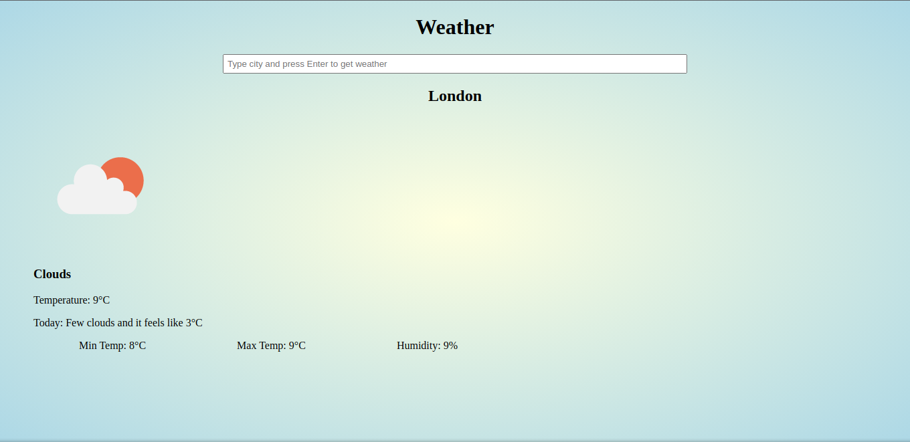

# Weather App

## Screenshot

## Description

A simple JS Project for fetching weather data for specific cities.

## Setup
- Clone the project by running `git clone https://github.com/krishnzzz/weather.git` on terminal or CMD
- Run terminal or CMD from the project directory.
- Run `index.html` from dist folder in your Web Browser.
- If further changes are required in the src folder, run `npm install` if to install all required packages.
- Then, run `npm run dev` in terminal or CMD from the project directory.
- For tests, run `npx jest`.

## Built With

- HTML 
- CSS
- Linter
- JS
- Webpack
- VScode
- Async

## Demo Link

https://krishnzzz.github.io/weather/

## Contributing

Contributions, issues and feature requests are welcome! Start by:

  - Forking the project
  - Cloning the project to your local machine
  - cd into the project directory
  - Run git checkout -b your-branch-name
  - Make your contributions
  - Push your branch up to your forked repository
  - Open a Pull Request with a detailed description to the development branch of the original project for a review

## Author

👤 Suyash Fowdar
Github: [@Krishnzzz](https://github.com/krishnzzz)

## Show your Support
Give a ⭐ if you like this project!
